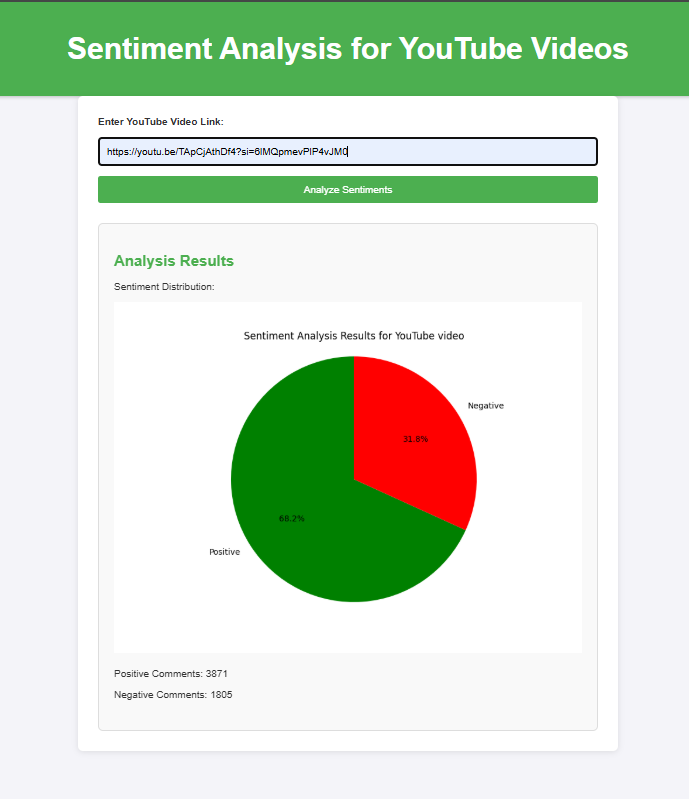

# 📊 YouTube Comment Sentiment Analysis (LSTM + Flask)

This project performs **sentiment analysis** on comments from a YouTube video using a trained **LSTM model**. It provides both a **CLI** and **Flask web interface** for visualizing the distribution of **positive** and **negative** sentiments.

---

## 🚀 Features

- 🧠 Trained LSTM model for sentiment classification.
- 🗣️ Automatically extracts comments from any public YouTube video.
- 🧹 Preprocessing includes stopword removal, lemmatization, and tokenization.
- 📈 Pie chart visualization of sentiment results.
- 🌐 Flask web app to interact with the model in real time.

---

## 📁 Project Structure

```
NEW_SMST/
├── Dataset/                            # Dataset used for training (CSV files)
├── model/
│   ├── saved_model/
│   │   ├── lstm_sentiment_model.h5     # Trained LSTM model
│   │   ├── tokenizer.pkl               # Tokenizer for preprocessing
│   │   └── label_encoder.pkl           # Label encoder for sentiments
│   ├── test.py                         # Script to test model with YouTube links
│   └── train.py                        # Script to train the model
├── static/
│   ├── plot.png                        # Generated sentiment chart
│   └── style.css                       # CSS styling for web app
├── templates/
│   └── index.html                      # HTML template for the Flask app
├── .env                                # Contains API key
├── .gitignore
├── app.py                              # Flask application entry point
├── README.md
└── requirements.txt
```

---

## 🛠️ Installation

### 1. Clone the repository

```bash
git clone [https://github.com/yourusername/your-repo-name.git](https://github.com/SanjayKumar3110/sentiment_analysis.git)
cd your-repo-name
```

### 2. Install dependencies

```bash
pip install -r requirements.txt
```

### 3. Add YouTube API Key

Create a `.env` file in the project root and add your API key:

```
API_KEY=your_youtube_data_api_key
```

---

## 🧠 Model Training

To train the LSTM model on sentiment data (IMDB or custom dataset):

```bash
python model/train.py
```

This will generate:

- `saved_model/lstm_sentiment_model.h5`
- `saved_model/tokenizer.pkl`

---

## 🧪 Run CLI (Test multiple videos)

```bash
python model/test.py
```

It will repeatedly prompt for YouTube links and output sentiment results with a pie chart.

---

## 🌐 Run Flask Web App

```bash
python app.py
```

Then open [http://localhost:5000](http://localhost:5000) in your browser.

---

## 📷 Screenshot




---

## ✅ Requirements

- Python 3.8+
- TensorFlow/Keras
- NLTK
- Flask
- Google API Client

All packages can be installed via `requirements.txt`.

---

## 📌 Notes

- Only works on public YouTube videos with visible comments.
- Make sure your Google API key has access to the **YouTube Data API v3**.

---

## 🙌 Acknowledgments

- [Google YouTube Data API](https://developers.google.com/youtube/v3)
- [IMDB Sentiment Dataset](https://ai.stanford.edu/~amaas/data/sentiment/)
- [Keras LSTM Documentation](https://keras.io/api/layers/recurrent_layers/lstm/)
